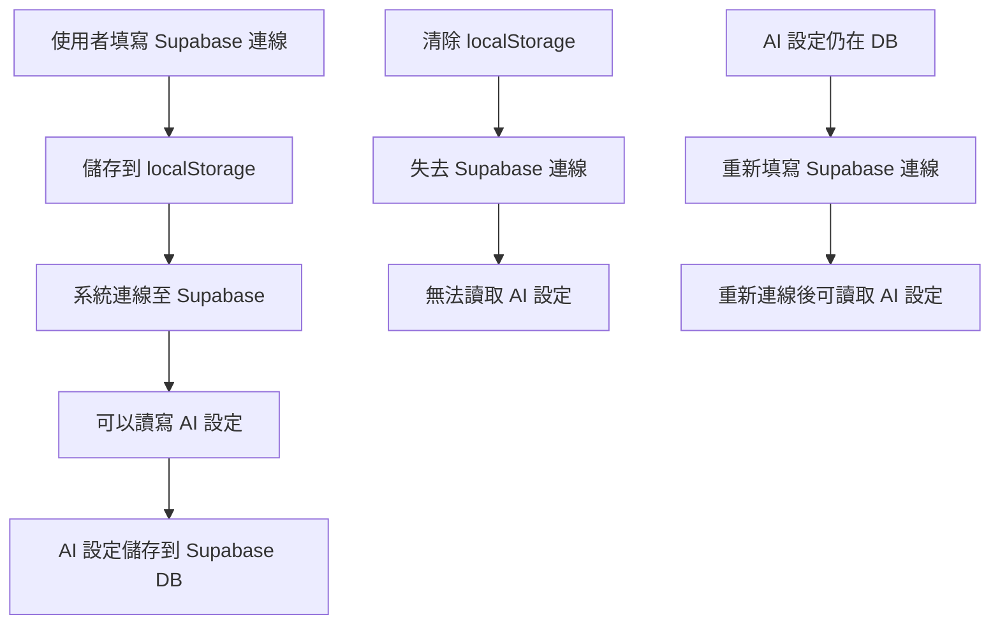

# 🚨 資料遺失問題診斷與解決方案

> **日期**：2024-12-23  
> **問題**：Supabase 連線設定與 AI 設定資料消失  
> **優先級**：🔴 高

---

## 📊 問題描述

使用者回報「Supabase 連線設定與 AI 設定資料又不見了，先前才儲存過」。

### 受影響的資料

| 資料類型 | 儲存位置 | 狀態 |
|---------|---------|------|
| **Supabase URL** | `localStorage` | ❌ 遺失 |
| **Supabase Anon Key** | `localStorage` | ❌ 遺失 |
| **Schema Name** | `localStorage` | ❌ 遺失 |
| **AI 設定** | Supabase DB `aiproject.system_ai_config` | ❓ 無法確認（因連線資訊遺失） |

---

## 🔍 可能的原因分析

### 原因 1：localStorage 被清除（最可能）

**觸發情境**：
- 使用者手動清除瀏覽器快取
- 使用者點擊「清除所有資料」按鈕
- 瀏覽器隱私模式（Incognito）
- 瀏覽器儲存空間已滿

**驗證方法**：
```javascript
// 在瀏覽器 Console 執行
console.log('Supabase URL:', localStorage.getItem('supabase_url'));
console.log('Supabase Key:', localStorage.getItem('supabase_anon_key'));
console.log('Schema Name:', localStorage.getItem('supabase_schema'));
console.log('All Keys:', Object.keys(localStorage));
```

---

### 原因 2：剛剛移除 DevToolsPanel 時不小心觸發了什麼（不太可能）

**檢查結果**：
- ✅ 移除 DevToolsPanel 的操作**不會**影響 localStorage
- ✅ 沒有修改任何儲存相關的程式碼
- ✅ 僅移除了 UI 元件和引用

---

### 原因 3：資料儲存邏輯有問題（需要排查）

**可能的問題**：
- Supabase 連線設定儲存失敗但沒有正確提示
- AI 設定儲存失敗但沒有正確提示
- Schema 名稱不正確導致資料讀取失敗

---

## 🛠️ 解決方案

### 立即行動：使用診斷工具

我已經建立了一個**系統診斷工具**，請執行以下步驟：

#### 步驟 1：前往設定頁面

1. 點擊左側導航的「**設定**」
2. 您會看到一個藍色的「**系統診斷工具**」面板
3. 點擊「**重新檢查**」按鈕

#### 步驟 2：檢視診斷結果

診斷工具會檢查：

| 檢查項目 | 說明 |
|---------|------|
| ✅ **Supabase URL** | 是否存在於 localStorage |
| ✅ **Supabase Anon Key** | 是否存在於 localStorage |
| ✅ **Schema Name** | 是否已設定（預設 aiproject） |
| ✅ **LocalStorage 總覽** | 查看所有 localStorage keys |
| ✅ **專案資料** | 是否有專案相關資料 |

#### 步驟 3：根據診斷結果採取行動

**如果 Supabase 連線資訊遺失（紅色 ❌）**：
1. 前往「系統設定」→「Supabase 連線」
2. 重新填寫：
   - Supabase URL（例如：`https://xxx.supabase.co`）
   - Anon Key
   - Schema Name（建議使用 `aiproject`）
3. 點擊「測試連線」確認可連線
4. 點擊「儲存設定」

**如果 AI 設定遺失**：
1. 前往「系統設定」→「AI 設定」
2. 重新填寫：
   - AI 供應商（OpenAI）
   - 模型（gpt-4o）
   - API Key（sk-...）
3. 點擊「測試連線」確認 API Key 有效
4. 點擊「儲存設定」

---

## 🔐 資料儲存機制說明

### Supabase 連線設定

```typescript
// 儲存位置：localStorage
localStorage.setItem('supabase_url', 'https://xxx.supabase.co');
localStorage.setItem('supabase_anon_key', 'eyJ...');
localStorage.setItem('supabase_schema', 'aiproject');
```

**為什麼使用 localStorage？**
- ✅ 不需要額外的資料庫表格
- ✅ 可以在未連線時也能顯示設定
- ✅ 方便快速讀取

**缺點**：
- ❌ 清除瀏覽器資料會遺失
- ❌ 無法跨裝置同步
- ❌ 沒有版本控制

---

### AI 設定

```typescript
// 儲存位置：Supabase 資料庫
// Schema: aiproject (固定)
// Table: system_ai_config

{
  id: "uuid",
  provider: "openai",
  model: "gpt-4o",
  api_key: "sk-...",
  api_endpoint: null,
  is_active: true,
  test_status: "success",
  last_tested_at: "2024-12-23T...",
  created_at: "2024-12-23T...",
  updated_at: "2024-12-23T..."
}
```

**為什麼使用 Supabase DB？**
- ✅ API Key 安全儲存（不在 localStorage）
- ✅ 支援多筆設定（歷史記錄）
- ✅ 可以查詢測試狀態與測試時間

**前提條件**：
- ⚠️ **必須先設定 Supabase 連線**（否則無法讀寫）
- ⚠️ **必須先建立 `aiproject` schema 和表格**

---

## 📚 資料依賴關係



**重點**：
1. ⚠️ **Supabase 連線資訊** 是基礎，遺失後會導致所有功能失效
2. ✅ **AI 設定** 儲存在資料庫中，重新連線後可以復原
3. ⚠️ **如果連線資訊遺失，必須重新填寫**

---

## 🛡️ 預防措施

### 短期方案

#### 1. 匯出設定功能

新增「匯出設定」按鈕，將連線資訊匯出為 JSON：

```typescript
const exportSettings = () => {
  const settings = {
    supabase_url: localStorage.getItem('supabase_url'),
    supabase_anon_key: localStorage.getItem('supabase_anon_key'),
    supabase_schema: localStorage.getItem('supabase_schema'),
    exported_at: new Date().toISOString(),
  };
  
  const blob = new Blob([JSON.stringify(settings, null, 2)], { type: 'application/json' });
  const url = URL.createObjectURL(blob);
  const a = document.createElement('a');
  a.href = url;
  a.download = `supabase-settings-${Date.now()}.json`;
  a.click();
};
```

#### 2. 匯入設定功能

新增「匯入設定」按鈕，從 JSON 檔案復原設定：

```typescript
const importSettings = (file: File) => {
  const reader = new FileReader();
  reader.onload = (e) => {
    const settings = JSON.parse(e.target?.result as string);
    localStorage.setItem('supabase_url', settings.supabase_url);
    localStorage.setItem('supabase_anon_key', settings.supabase_anon_key);
    localStorage.setItem('supabase_schema', settings.supabase_schema);
    toast.success('✅ 設定已匯入');
  };
  reader.readAsText(file);
};
```

#### 3. 自動備份

定期將設定備份到 Supabase DB（加密後）：

```typescript
// 每次儲存設定時，同時備份到 DB
const backupSettings = async () => {
  const settings = {
    supabase_url: localStorage.getItem('supabase_url'),
    supabase_anon_key: localStorage.getItem('supabase_anon_key'), // 應加密
    supabase_schema: localStorage.getItem('supabase_schema'),
  };
  
  // 儲存到 aiproject.system_settings
  await adapter.backupSystemSettings(settings);
};
```

---

### 長期方案

#### 1. 移除 localStorage 依賴

將 Supabase 連線資訊也儲存到資料庫：

**問題**：雞生蛋問題 - 如何在沒有連線的情況下讀取連線資訊？

**解決**：使用 Supabase 的 Public API（不需要認證）：

```typescript
// 使用 Project Reference ID 作為唯一識別
const projectRef = 'kaeghmhaxcmxakncxzvl'; // 從 URL 取得

// 查詢公開的連線設定（僅儲存 URL，不儲存 Key）
const { data } = await fetch(
  `https://kaeghmhaxcmxakncxzvl.supabase.co/rest/v1/public_settings?project_ref=eq.${projectRef}`
).then(res => res.json());
```

#### 2. 使用環境變數（僅適用於部署後）

```bash
# .env
VITE_SUPABASE_URL=https://xxx.supabase.co
VITE_SUPABASE_ANON_KEY=eyJ...
VITE_SCHEMA_NAME=aiproject
```

**缺點**：
- ❌ 需要重新部署才能更新
- ❌ 無法在 Figma Make 預覽環境中使用

---

## ✅ 行動檢查清單

### 立即執行

- [ ] 使用「系統診斷工具」檢查 localStorage 狀態
- [ ] 如果連線資訊遺失，重新填寫 Supabase 連線設定
- [ ] 測試 Supabase 連線（確認可以連線）
- [ ] 儲存 Supabase 連線設定
- [ ] 重新整理頁面

### 驗證 AI 設定

- [ ] 前往「系統設定」→「AI 設定」
- [ ] 檢查 AI 設定是否自動載入（如果之前有儲存）
- [ ] 如果沒有載入，重新填寫 AI 設定
- [ ] 測試 AI 連線（確認 API Key 有效）
- [ ] 儲存 AI 設定

### 後續改善

- [ ] 考慮新增「匯出設定」功能
- [ ] 考慮新增「匯入設定」功能
- [ ] 考慮新增自動備份機制
- [ ] 更新使用者文件，提醒備份連線資訊

---

## 🔗 相關文件

- [AI ChatGPT Integration Complete](/docs/AI_ChatGPT_Integration_Complete.md)
- [AI Next Steps](/docs/AI_Next_Steps.md)
- [OpenAI API Parameter Change](/docs/OpenAI_API_Parameter_Change.md)

---

## 📞 需要協助？

如果診斷工具顯示的結果不如預期，請：

1. **截圖診斷結果**並分享
2. **開啟瀏覽器 Console**（F12）並查看是否有錯誤訊息
3. **嘗試重新填寫設定**並觀察儲存過程

---

**文件版本**：v1.0  
**最後更新**：2024-12-23  
**更新者**：AI Assistant
